# Tab Neighbor

Minimal Chrome extension (MV3) that opens new tabs next to the active tab
instead of at the end of the strip. Works for `⌘T`, the `+` button,
bookmarks, and links — and below it with vertical tabs.

No build step, no dependencies, no tracking, minimal permissions —
it never reads page content or URLs.

## Install

`chrome://extensions` → **Developer mode** → **Load unpacked** → select this folder.

## Options

Right-click the extension icon → **Options**: master switch, reposition
link-opened tabs, keep related tabs together, join the active tab's group.

## License

[The Unlicense](LICENSE) — public domain.
